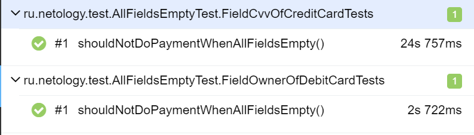
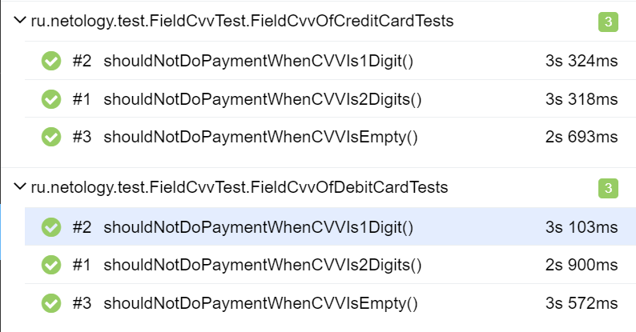

# Отчёт по итогам тестирования
## Краткое описание
В рамках данного проекта стояла задача - автоматизировать тестирование комплексного сервиса покупки тура, взаимодействующего с СУБД (PostgreSQL и MySQL) и API банка.

В ходе тестирования было автоматизированно **50 тест-кейсов**.

## Статистика успешных/неуспешных тест-кейсов
### При подключении к СУБД MySQL:

Из них:

* **успешных** оказалось **29** тест-кейсов (**57,99%**);
* **не прошёл** **21** тест-кейс (**42,01%**).

### API-тесты
Проведено 4 тест-кейса на подключение к БД, все прошли успешно:

### UI-тесты
**Позитивные - 4** тест-кейса, из которых **2 успешные**, **2 не прошли**:

**Негативные - 42** тест-кейса, из которых **23 успешные**, **19 не прошли**:

### При подключении к СУБД PostgreSQL:

Из них:

* **успешных** оказалось **28** тест-кейсов (**56%**);

* **не прошли** **22** тест-кейса (**44%**)

### API-тесты
Проведено 4 тест-кейса на подключение к БД, все прошли успешно:

### UI-тесты
**Позитивные - 4** тест-кейса, из которых **4 не прошли**:

**Негативные - 42** тест-кейса, из которых **24 успешные**, **18 не прошли**:

## Общие рекомендации
1. Исправить орфографическую ошибку на главной странице сервиса в слове "Марракэш".
2. Предусмотреть, чтобы когда какое-либо поле ввода остается пустым, то под ним появлялось сообщение об ошибке "Поле обязательно для заполнения", а не "Неверный формат", как сейчас. Именно по этой причине наибольшее количество упавших тестов.
3. Для поля "Владелец" ввести ограничение на вводимые символы - только латинские буквы, не зависящие от регистра.
4. Изменить статус "Успешная операция" на "Ошибка! Банк отказал в проведении операции." при оплате картой со статусом "Declined".
5. Решить проблему с некорректным взаимодействием SUT с СУБД PostgreSQL, из-за чего падают тесты, которые успешно проходят на MySQL (см. [issues12](https://github.com/Oleg50sev/QA31-Diploma-Project/issues/13), [issues13](https://github.com/Oleg50sev/QA31-Diploma-Project/issues/14))
6. По возможности, сделать кнопку "Продолжить" не активной, если какие-то поля ввода пустые и/или заполнены невалидными данными.

Полный список обнаруженных дефектов находится в [issues](https://github.com/Oleg50sev/QA31-Diploma-Project/issues).